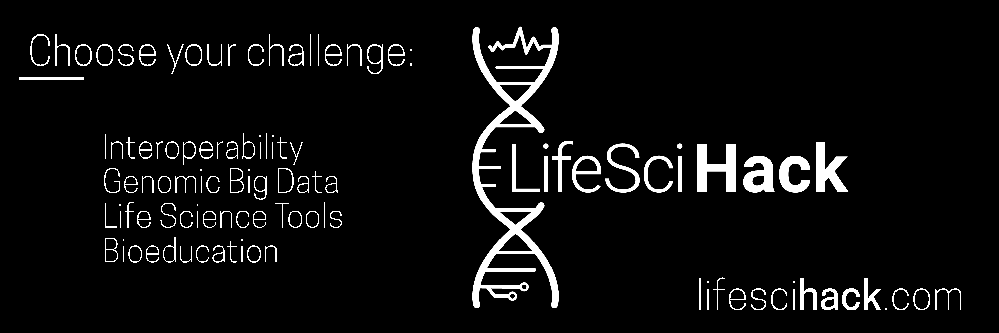
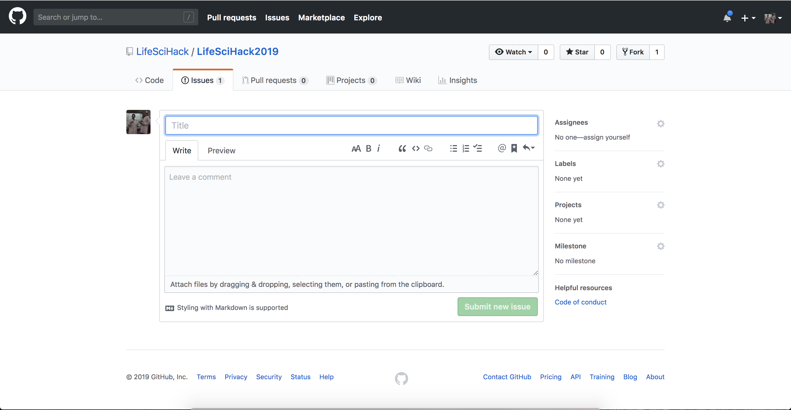
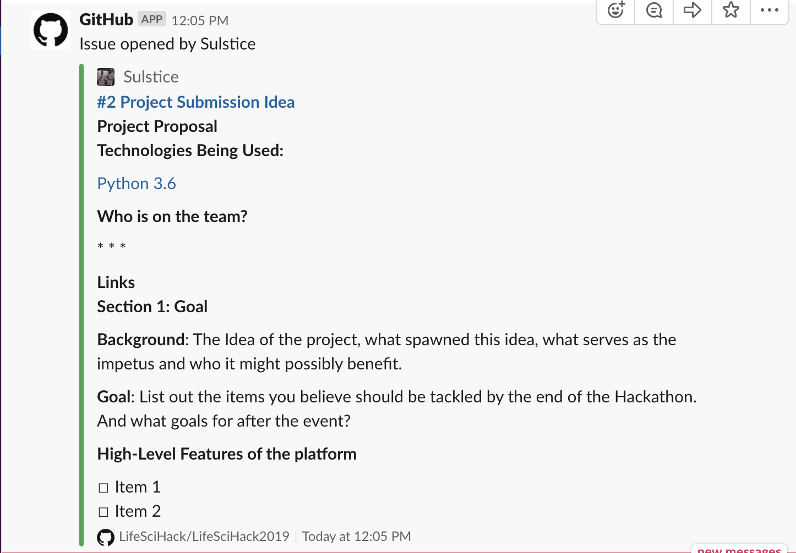

# LifeSciHack2019

Welcome to the submission repository for the LifeSciHack 2019!

## Gitter

To meet potential team members, chat about projects, or get help with your code for LifeSciHack2019, head over join the slack workspace lifescihack2019.slack.com

# Submission Guidelines

Participating in the hackathon is as easy as contributing to an open source project on GitHub. Exactly so, because you will register your project by creating an issue in this repository, and submit it by creating a pull request.

Here’s how it works:

## The Submission Process

### 1) Create an issue
Your first step is to create an issue in the `LifeSciHack2019` repository. This issue acts as a "soft" registration for the hackathon, and can help you to coordinate your ideas with other participants. An issue is a good place to talk openly about your project ideas with others before you decide on its exact scope.

You can find the issue tab at the top of this repo. 

Here you can view all project submission ideas:

Create the Issue:

Submit the Proposal

Use your issue to talk with collaborators, brainstorm, and organize. Check out the other issues to see if there are participants who want to work on the same things.

Members of the lifescihack team will be able to point other participants to your issue (if it looks like they can help), help you with technical questions, or just offer support :)

Issue events will also be pulled into the Slack feed [Slack](lifescihack2019.slack.com) which is a better place for more general discussion and chatting.

### 2) Build with LifeSciHack 2019
Work on your project as you like. How you work is up to you; We recommend creating a new GitHub repo for your team. Remember to only begin working on your project after the hackathon begins on February 1st!

Use the issue you created in step 1 to let others know where your project lives. You might want discuss any technical challenges or attract additional teammembers.

Wherever you work, remember that your project should include an **Open Source License** of [some form](https://opensource.org/licenses), and should be accessible to everyone after the submission deadline.

### 3) Fork and PR
When you feel ready to submit, create a new fork of the LifeSciHack repo, and add your project as a markdown file inside `LifeSciHack2019/submissions/`.

You can find the fork button at the top right of this repo. 

You can use `submissions/EXAMPLE.md` as a template if you like.

Be sure that your project's folder links to the repo you've been working in, and contains any other supporting materials that you want evaluated by judges (such as links to a pitch deck or demo video).

Once ready, submit via a new [pull request](https://github.com/LifeSciHack/LifeSciHack2019/pulls).

*Opening a Pull Request establishes your project as an "official" submission*

You can open a PR before the submission deadline and continue to work, but all materials must be finalized *before* the end of the hackathon. Any commits to your project submission after the deadline will not be considered.

We'd also recommend referencing the issue you created in step 1 [using keywords](https://help.github.com/articles/closing-issues-using-keywords/) in your PR.

**Submit your pull request before the submission deadline: _February 3, 12:00 CST_**

### 4) Congratulate your team (and yourself) on a job well-done
Whether or not you get a prize, you deserve to be proud of your work. Thanks for participating in the hackathon!

## Judges and Scoring

Submissions will be graded across the following equally-weighted criteria:

1. Functionality
2. Creativity
3. Difficulty
4. Design
5. Impact on category 

Info about our super-awesome judges panel can be found on [the hackathon website](lifescihack.com/judges).
